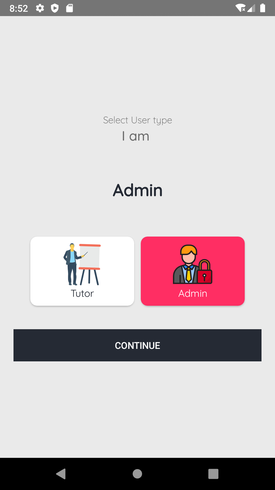
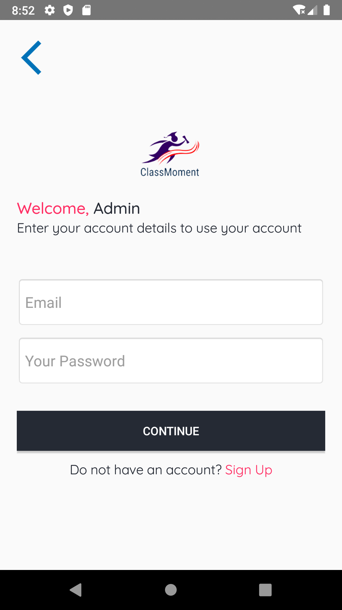

# TekMoment

TekMoment has decided to help its students beter understand android applicaition development practically. This is being achieved through the step by step development of an E-learning application intentionally named ClassMoment. 
Feel free to get into the code and try to understand what ever is happening as best as possible.
All explaniations can be acquired in the Schoology classroom. 

# Images
 
